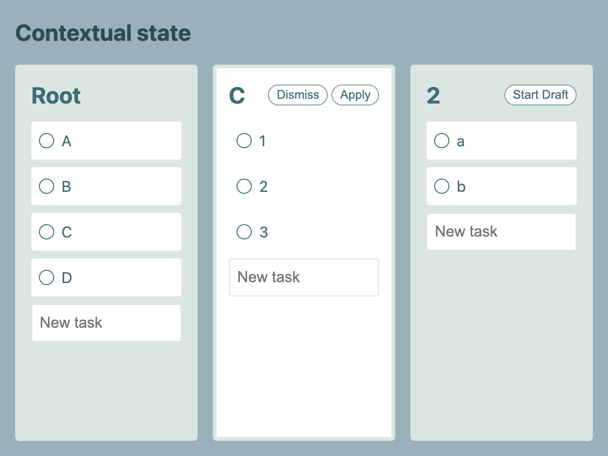

# Why context – Contextual state

Contextual state is a system to reuse components in different locations of the component tree but make them behave differently by providing them the same interface but different behavior.
Because in many applications we expect for an optimistic update, we usually use an API that usually updates models across all the application. It doesn’t matter if it’s Redux or MobX or Veux or Ember-Data, Sometimes we need to isolate some part of the application to create a different flow of information, but it’s always useful if we can do the minimum to support this.
It is possible to go all the way with props drilling, but it’s not realistic in a large project with a tight schedule.

What is useful for:

- Testing
- Pipe line for intercepting and mutating state
- Expand new behaviors to an already existing codebase. For example:
  - Undo / Redo support
  - Multiple user logins to components that know only to work with a single use
  - First-time user experience (for “mocked data”)

\* The demo isn’t an example for how is the best way to design it or the most performance, it’s only for showing the possibilities of contextual state.

## Demos

There is no different in UX between compiled examples

- [React](https://orisomething.github.io/why-context/contextual-state-react/)
