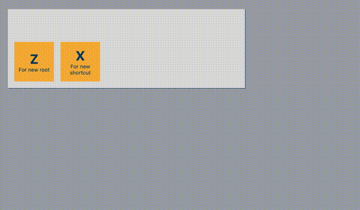

# Why context – Keyboard management

Keyboard management system is one of the most beneficial cases to use context.
If you base your shortcuts on the component tree, it makes it almost automatically manage “priorities”, “shortcuts overrides” and “shut down shortcuts”.

The basic idea is that every component registers its shortcuts and decides if these shortcuts are added or ignore all shortcuts from the upper part of the component tree. Of course, in a real application a more complex system is needed.
Since components like modals and tooltips are usually in different places in the DOM compared to the component tree. We can utilize context to get more accurate results for when shortcuts should be added or not. It means, if we add a modal we probably want to silent all shortcuts from the upper place of the tree, but tooltips even though will be added by a “portal” we might want add addition shortcuts instead of declaring a “new root”, but since it located in a different part of the DOM we’ll find a hard time to manage it.

It’s important to know, this is very basic keyboard management system:
- It doesn’t address most real-application needs
- It doesn’t address basic performance issues
- It doesn’t address keyboard events quirks or layout
- It does show the benefit of using context
